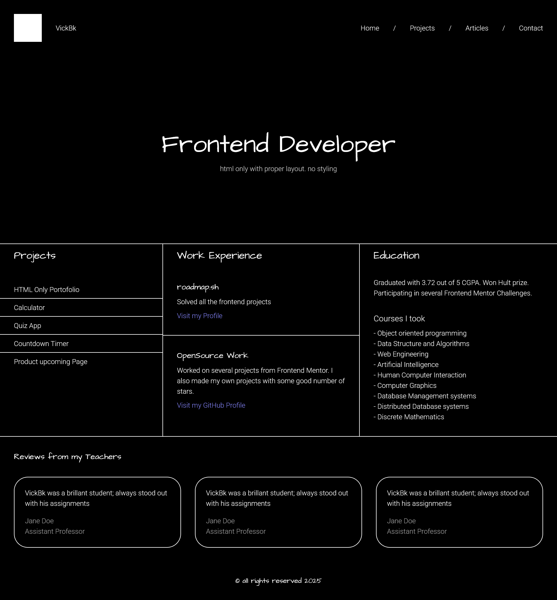
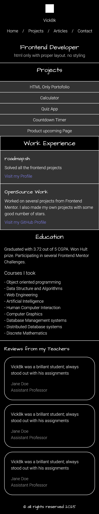
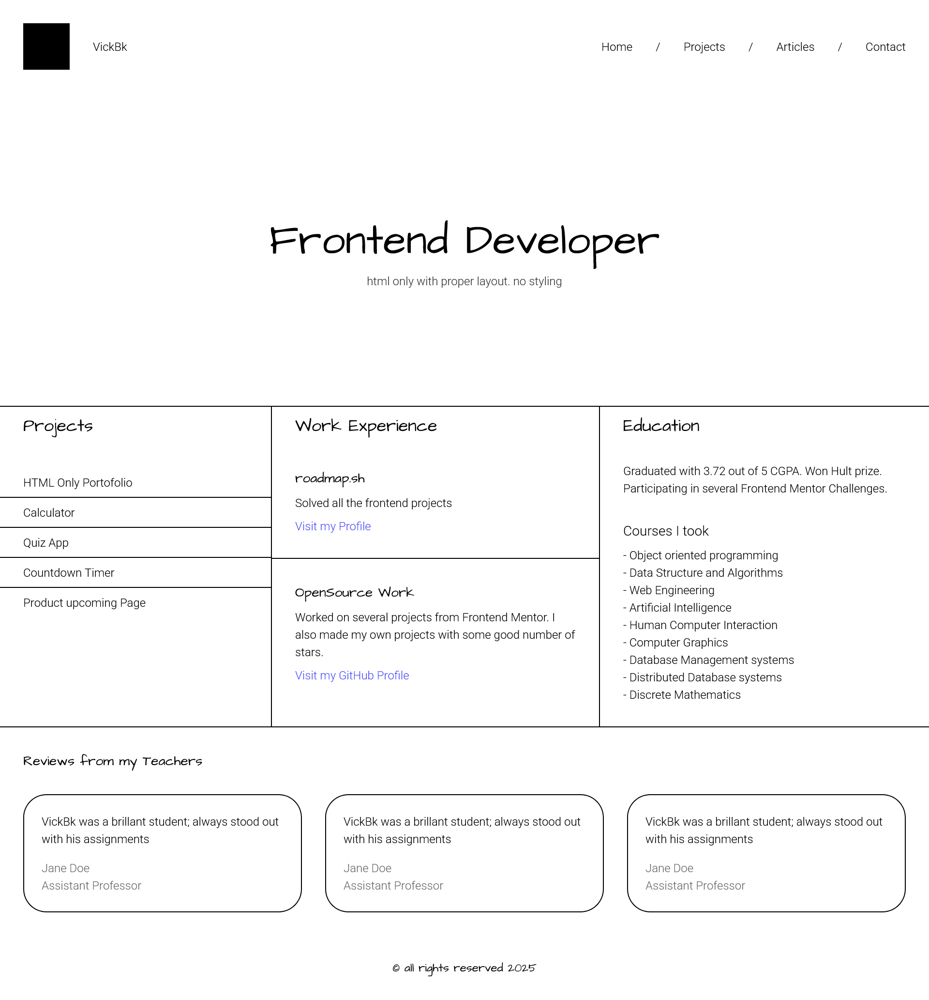
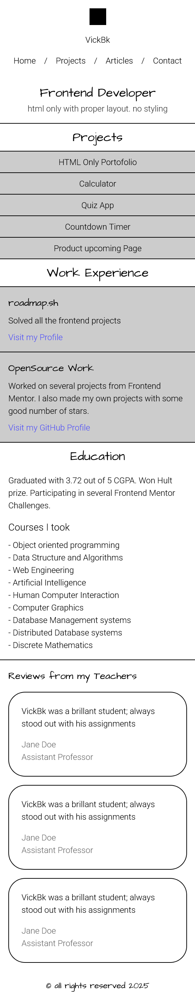

# roadmap.sh - Personnel Portofolio

This is a solution to the [Personnel portofolio website project](https://roadmap.sh/projects/portfolio-website). roadmap.sh challenges help you improve your coding skills by building.

## Table of contents

- [Overview](#overview)
  - [The challenge](#the-challenge)
  - [Screenshot](#screenshot)
  - [Links](#links)
- [My process](#my-process)
  - [Built with](#built-with)
  - [Useful resources](#useful-resources)
- [Author](#author)
- [Acknowledgments](#acknowledgments)

## Overview

### The challenge

In this project, you will style the HTML website structure you created previously in a different project. The focus will be on learning how to use CSS to create responsive layouts, apply color and typography, and enhance the overall design of your website.

#### Submission Requirements

- Your submission should include:
  - A fully styled, responsive website with the same structure as the previous project.
  - Consistent use of a chosen color scheme and typography.
  - Proper use of CSS techniques like Flexbox, media queries, and the box model.
  - A responsive navigation bar and well-styled contact form.

#### Bonus Points

- For bonus points, you can:

  - Use Google Fonts to enhance the typography of your website.
  - Look into GitHub Pages or Cloudflare Pages to host your website for free.
  - Add support for dark mode using CSS variables.

- View the optimal layout for the site depending on their device's screen size
- See hover states for all interactive elements on the page
- Receive an error message when the newsletter form is submitted if:
  - The input field is empty
  - The email address is not formatted correctly

### Screenshot

### Links

- Solution URL: [Github Repository](https://github.com/vickbk/vickbk.github.io/tree/main/frontend/personnel-portofolio) Reference: [Github Page](https://vickbk.github.io/frontend/personnel-portofolio/)

## My process

### Built with

- Semantic HTML5 markup
- CSS custom properties
- Flexbox
- CSS Grid
- Mobile-first workflow

### Useful resources

- [Roadmap](https://roadmap.sh) - Helped me get started with this journey and still leading me throughout the process
- [Kevin Powell](https://courses.kevinpowell.co/conquering-responsive-layouts) - These ressources got my steps into basics of modern responsive design :)
- [Frontend Mentor](https://www.frontendmentor.io) - Currently working with frontend mentor is upskilling me and I want to learn more here... Im not yet to leave

## Author

- Github - [@vickbk](https://github.com/vickbk)
- Roadmap - [@vickbk](https://roadmap.sh/u/vickbk)
- Frontend Mentor - [@vickbk](https://www.frontendmentor.io/profile/vickbk)
- Twitter - [@Vick_bk8](https://x.com/Vick_bk8)

## Acknowledgments

For this project I use most of the knowlegde I got from the frontend roadmap, frontendmentor for HTML & css tricks and technics, accessibility and various developement techniques...
