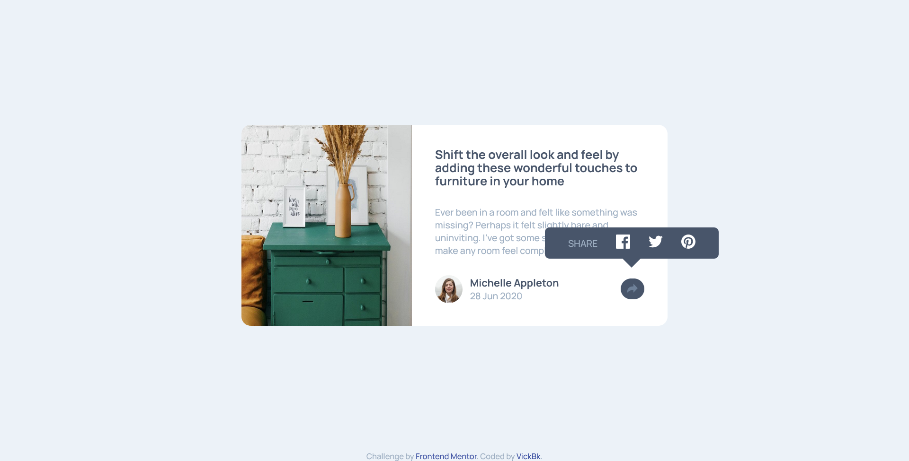
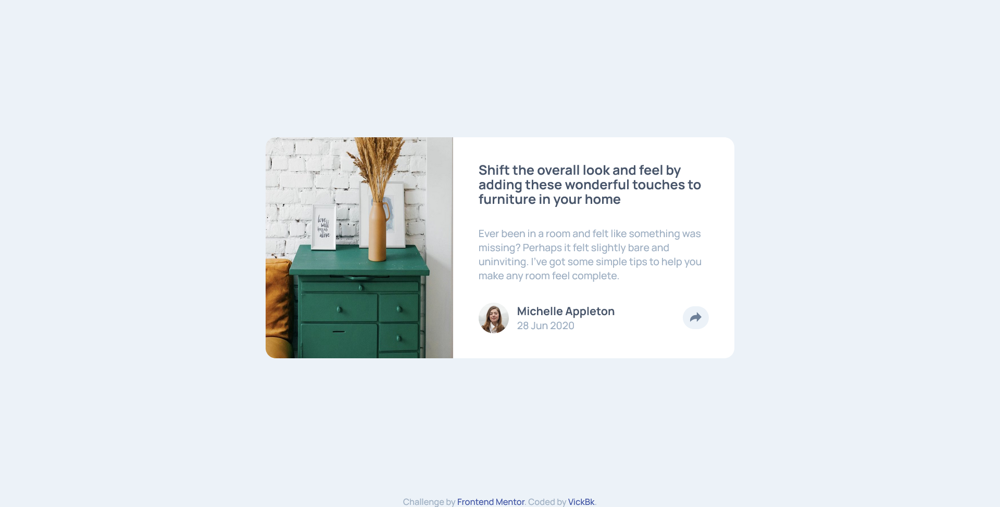
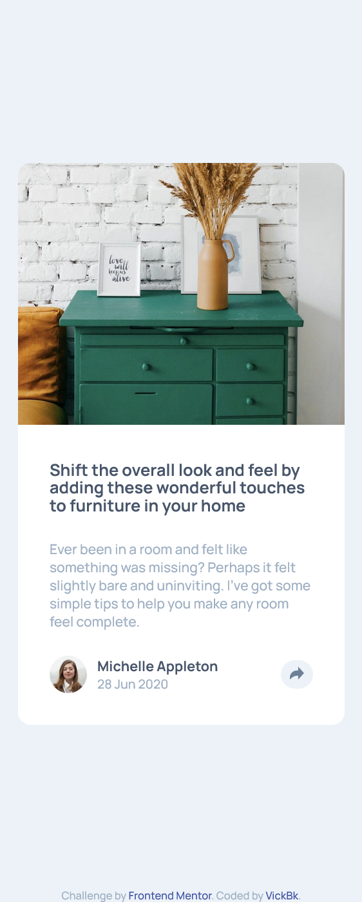

# Frontend Mentor - Article preview component solution

This is a solution to the [Article preview component challenge on Frontend Mentor](https://www.frontendmentor.io/challenges/article-preview-component-dYBN_pYFT). Frontend Mentor challenges help you improve your coding skills by building realistic projects.

## Table of contents

- [Overview](#overview)
  - [The challenge](#the-challenge)
  - [Screenshot](#screenshot)
  - [Links](#links)
- [My process](#my-process)
  - [Built with](#built-with)
  - [What I learned](#what-i-learned)
  - [Continued development](#continued-development)
  - [Useful resources](#useful-resources)
- [Author](#author)
- [Acknowledgments](#acknowledgments)

## Overview

### The challenge

Users should be able to:

- View the optimal layout for the component depending on their device's screen size
- See the social media share links when they click the share icon

### Screenshot






### Links

- Solution URL: [Add solution URL here](https://github.com/vickbk/vickbk.github.io/tree/main/frontendmentor/article-preview-component-master)
- Live Site URL: [Add live site URL here](https://vickbk.github.io/frontendmentor/article-preview-component-master/)

## My process

### Built with

- Semantic HTML5 markup
- CSS custom properties (using SASS)
- Flexbox
- CSS Grid
- Mobile-first workflow
- Vanila JS for site interraction

### What I learned

I learnt again how to draw the arrow using the borders

```css
element::after {
  content: "";
  inline-size: 0;
  block-size: 0;
  border-inline: 1em solid transparent; /* Adjust size as needed */
  border-block-start: 1em solid c.$dark-grey-blue; /* Color of the arrow */
}
```

### Continued development

I am still struggling with SASS but I am also starting to feel comfortable now with sass and with practice it will be fine.

- (https://roadmap.io) - Helped me get started with this journey and still leading me throughout the process
- (https://courses.kevinpowell.co/conquering-responsive-layouts) - These ressources got my steps into basics of modern responsive design :)
- (https://www.frontendmentor.io) - Currently working with frontend mentor is upskilling me and I want to learn more here... Im not yet to leave
- (https://www.joshwcomeau.com/) - Josh Comeau is now my new favorite for learning CSS tricks with interactive courses

## Author

- Github - [@vickbk](https://github.com/vickbk)
- Frontend Mentor - [@vickbk](https://www.frontendmentor.io/profile/vickbk)
- Twitter - [@Vick_bk8](https://x.com/Vick_bk8)

## Acknowledgments

For this project I use most of the knowlegde I got from @KevinJPowell & @Josh Comeau for css tricks and technics, roadmap.io for frontend developper roadmap.
