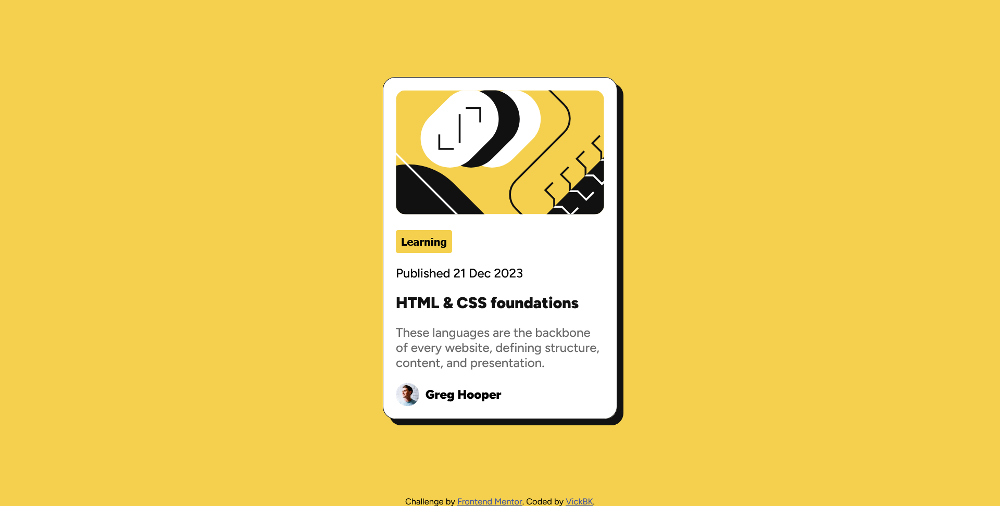

# Frontend Mentor - Blog preview card solution

This is a solution to the [Blog preview card challenge on Frontend Mentor](https://www.frontendmentor.io/challenges/blog-preview-card-ckPaj01IcS). Frontend Mentor challenges help you improve your coding skills by building realistic projects.

## Table of contents

- [Overview](#overview)
  - [The challenge](#the-challenge)
  - [Screenshot](#screenshot)
  - [Links](#links)
- [My process](#my-process)
  - [Built with](#built-with)
  - [What I learned](#what-i-learned)
  - [Continued development](#continued-development)
  - [Useful resources](#useful-resources)
- [Author](#author)
- [Acknowledgments](#acknowledgments)

## Overview

### The challenge

Users are able to:

- See hover and focus states for all interactive elements on the page

### Screenshot



### Links

- Solution URL: (https://github.com/vickbk/vickbk.github.io/tree/main/frontendmentor/blog-preview-card-main)
- Live Site URL: [Add live site URL here](https://vickbk.github.io/frontendmentor/blog-preview-card-main/)

## My process

### Built with

- Semantic HTML5 markup
- CSS custom properties
- Flexbox
- CSS Grid
- Mobile-first workflow

### What I learned

In this project I learnt about the clamp function for font resizing without using media queries

```css
.proud-of-this-css {
  font-size: clamp(15px, 4vw, 16px);
}
```

### Continued development

More practice will help me improve my css skills

### Useful resources

- (https://roadmap.io) - Helped me get started with this journey and still leading me throughout the process
- (https://courses.kevinpowell.co/conquering-responsive-layouts) - These ressources got my steps into basics of modern responsive design :)
- (https://www.frontendmentor.io) - Currently working with frontend mentor is upskilling me and I want to learn more here... Im not yet to leave

## Author

- Github - [@vickbk](https://github.com/vickbk)
- Frontend Mentor - [@vickbk](https://www.frontendmentor.io/profile/vickbk)
- Twitter - [@Vick_bk8](https://x.com/Vick_bk8)

## Acknowledgments

For this project I use most of the knowlegde I got from @KevinJPowell for css tricks and technics.
