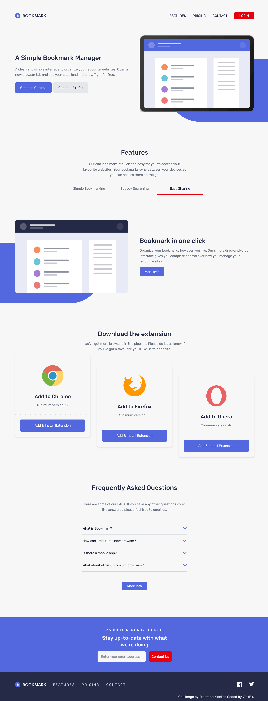
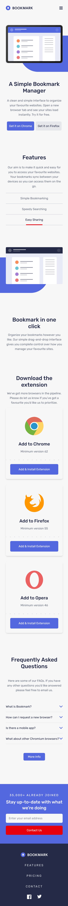

# Frontend Mentor - Bookmark landing page solution

This is a solution to the [Bookmark landing page challenge on Frontend Mentor](https://www.frontendmentor.io/challenges/bookmark-landing-page-5d0b588a9edda32581d29158). Frontend Mentor challenges help you improve your coding skills by building realistic projects.

## Table of contents

- [Overview](#overview)
  - [The challenge](#the-challenge)
  - [Screenshot](#screenshot)
  - [Links](#links)
- [My process](#my-process)
  - [Built with](#built-with)
  - [What I learned](#what-i-learned)
  - [Continued development](#continued-development)
  - [Useful resources](#useful-resources)
- [Author](#author)
- [Acknowledgments](#acknowledgments)

## Overview

### The challenge

Users should be able to:

- View the optimal layout for the site depending on their device's screen size
- See hover states for all interactive elements on the page
- Receive an error message when the newsletter form is submitted if:
  - The input field is empty
  - The email address is not formatted correctly

### Screenshot




### Links

- Solution URL: [Github Repository](https://github.com/vickbk/vickbk.github.io/tree/main/frontendmentor/bookmark-landing-page)
- Live Site URL: [Github Page](https://vickbk.github.io/frontendmentor/bookmark-landing-page/)

## My process

### Built with

- Semantic HTML5 markup
- CSS custom properties
- Flexbox
- CSS Grid
- [Tailwindcss](https://tailwindcss.com/) - CSS Framework
- Mobile-first workflow

### What I learned

In this project I learnet how to use the tailwindcss library and it was pretty good ride-through.
I was pissed of with the long list of utility classes at first, then I learnt how to use them is css files directly with the @apply directive.

```html
<h1 class="my-title">Some HTML code I'm proud of</h1>
```

```css
.my-title {
  @apply text-center p-4 text-xl;
}
```

### Continued development

I will try to use tailwind in later projects as to get more familiar with the library;

### Useful resources

- [Roadmap](https://roadmap.sh) - Helped me get started with this journey and still leading me throughout the process
- [Kevin Powell](https://courses.kevinpowell.co/conquering-responsive-layouts) - These ressources got my steps into basics of modern responsive design :)
- [Frontend Mentor](https://www.frontendmentor.io) - Currently working with frontend mentor is upskilling me and I want to learn more here... Im not yet to leave
- [Tailwind CSS](https://tailwindcss.com/docs/) - Helpful insight to get started with tailwind
- [Tailwind full course for Beginners](https://www.youtube.com/watch?v=lCxcTsOHrjo) - An Introduction to tailwind by Dave Gray referenced on roadmap.sh

## Author

- Github - [@vickbk](https://github.com/vickbk)
- Frontend Mentor - [@vickbk](https://www.frontendmentor.io/profile/vickbk)
- Twitter - [@Vick_bk8](https://x.com/Vick_bk8)

## Acknowledgments

For this project I use most of the knowlegde I got from the frontend roadmap, frontendmentor for HTML & css tricks and technics, accessibility and various developement techniques...
