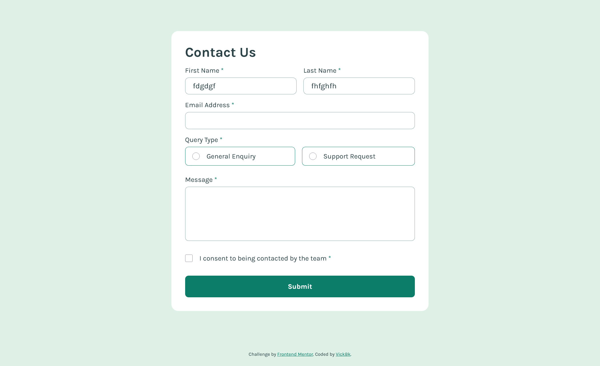
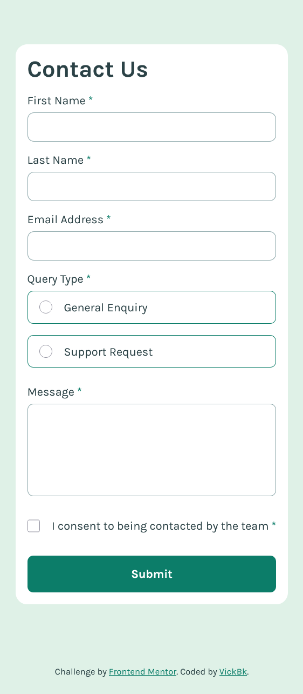

# Frontend Mentor - Contact form solution

This is a solution to the [Contact form challenge on Frontend Mentor](https://www.frontendmentor.io/challenges/contact-form--G-hYlqKJj). Frontend Mentor challenges help you improve your coding skills by building realistic projects.

## Table of contents

- [Overview](#overview)
  - [The challenge](#the-challenge)
  - [Screenshot](#screenshot)
  - [Links](#links)
- [My process](#my-process)
  - [Built with](#built-with)
  - [What I learned](#what-i-learned)
  - [Continued development](#continued-development)
  - [Useful resources](#useful-resources)
- [Author](#author)
- [Acknowledgments](#acknowledgments)

## Overview

### The challenge

Users should be able to:

- Complete the form and see a success toast message upon successful submission
- Receive form validation messages if:
  - A required field has been missed
  - The email address is not formatted correctly
- Complete the form only using their keyboard
- Have inputs, error messages, and the success message announced on their screen reader
- View the optimal layout for the interface depending on their device's screen size
- See hover and focus states for all interactive elements on the page

### Screenshot

### Links

- Solution URL: [Git Repo](https://github.com/vickbk/vickbk.github.io/tree/main/frontendmentor/contact-form)
- Live Site URL: [Github Pages](https://vickbk.github.io/frontendmentor/contact-form)

## My process

### Built with

- Semantic HTML5 markup
- CSS custom properties
- Flexbox
- CSS Grid
- Mobile-first workflow

### What I learned

In this project I learnent mostly about accessibility and aria utilization.

### Continued development

I will keep practicing accessibility as to get familiar with its usage.

### Useful resources

- [Roadmap](https://roadmap.io) - Helped me get started with this journey and still leading me throughout the process
- [Kevin Powell](https://courses.kevinpowell.co/conquering-responsive-layouts) - These ressources got my steps into basics of modern responsive design :)
- [Frontend Mentor](https://www.frontendmentor.io) - Currently working with frontend mentor is upskilling me and I want to learn more here... Im not yet to leave
- [Josh Comeau](https://www.joshwcomeau.com/) - Josh Comeau is now my new favorite for learning CSS tricks with interactive courses

## Author

- Github - [@vickbk](https://github.com/vickbk)
- Frontend Mentor - [@vickbk](https://www.frontendmentor.io/profile/vickbk)
- Twitter - [@Vick_bk8](https://x.com/Vick_bk8)

## Acknowledgments

For this project I use most of the knowlegde I got from the frontend roadmap, frontendmentor for HTML & css tricks and technics, accessibility and various developement techniques...
