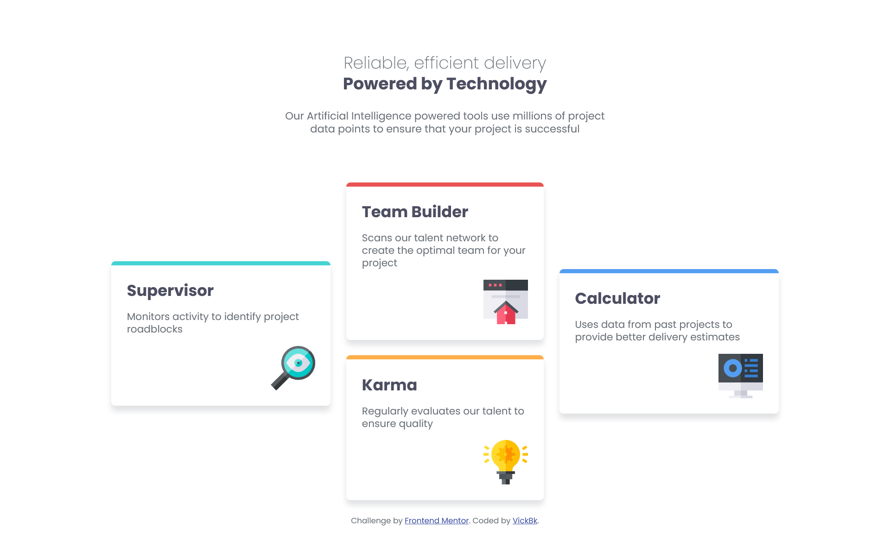
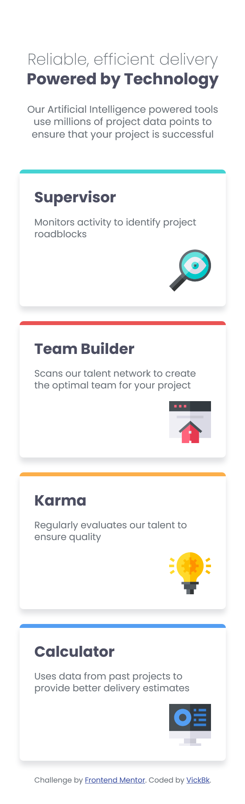

# Frontend Mentor - Four card feature section solution

This is a solution to the [Four card feature section challenge on Frontend Mentor](https://www.frontendmentor.io/challenges/four-card-feature-section-weK1eFYK). Frontend Mentor challenges help you improve your coding skills by building realistic projects.

## Table of contents

- [Overview](#overview)
  - [The challenge](#the-challenge)
  - [Screenshot](#screenshot)
  - [Links](#links)
- [My process](#my-process)
  - [Built with](#built-with)
  - [What I learned](#what-i-learned)
  - [Continued development](#continued-development)
  - [Useful resources](#useful-resources)
- [Author](#author)
- [Acknowledgments](#acknowledgments)

**Note: Delete this note and update the table of contents based on what sections you keep.**

## Overview

### The challenge

Users are be able to:

- View the optimal layout for the site depending on their device's screen size

### Screenshot

### Links

- Solution URL: (https://github.com/vickbk/vickbk.github.io/tree/main/frontendmentor/four-card-feature-section-master)
- Live Site URL: (https://vickbk.github.io/frontendmentor/four-card-feature-section-master/)

## My process

### Built with

- Semantic HTML5 markup
- SCSS for more organised CSS
- CSS custom properties
- Flexbox
- Mobile-first workflow

### What I learned

Here I mostly learnt the basic usage of SASS for a more reusable CSS.

### Continued development

For the up coming challenges I will keep practicing SASS as to get more familiar and improve my usage of it.

### Useful resources

- (https://roadmap.io) - Helped me get started with this journey and still leading me throughout the process
- (https://courses.kevinpowell.co/conquering-responsive-layouts) - These ressources got my steps into basics of modern responsive design :)
- (https://www.frontendmentor.io) - Currently working with frontend mentor is upskilling me and I want to learn more here... I'm not yet to leave

## Author

- Github - [@vickbk](https://github.com/vickbk)
- Frontend Mentor - [@vickbk](https://www.frontendmentor.io/profile/vickbk)
- Twitter - [@Vick_bk8](https://x.com/Vick_bk8)

## Acknowledgments

For this project I use most of the knowlegde I got from @KevinJPowell for css tricks and technics.
