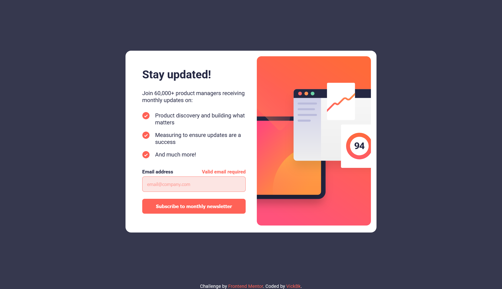
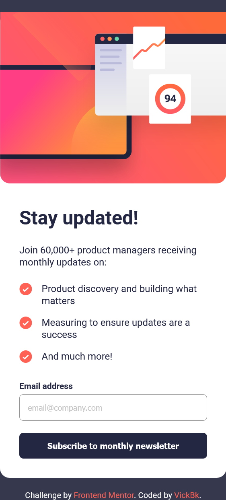

# Frontend Mentor - Newsletter sign-up form with success message solution

This is a solution to the [Newsletter sign-up form with success message challenge on Frontend Mentor](https://www.frontendmentor.io/challenges/newsletter-signup-form-with-success-message-3FC1AZbNrv). Frontend Mentor challenges help you improve your coding skills by building realistic projects.

## Table of contents

- [Overview](#overview)
  - [The challenge](#the-challenge)
  - [Screenshot](#screenshot)
  - [Links](#links)
- [My process](#my-process)
  - [Built with](#built-with)
  - [What I learned](#what-i-learned)
  - [Continued development](#continued-development)
  - [Useful resources](#useful-resources)
- [Author](#author)
- [Acknowledgments](#acknowledgments)

## Overview

### The challenge

Users should be able to:

- Add their email and submit the form
- See a success message with their email after successfully submitting the form
- See form validation messages if:
  - The field is left empty
  - The email address is not formatted correctly
- View the optimal layout for the interface depending on their device's screen size
- See hover and focus states for all interactive elements on the page

### Screenshot






### Links

- Solution URL: [Github Repository](https://github.com/vickbk/vickbk.github.io/tree/main/frontendmentor/newsletter-sign-up-with-success-message-main)
- Live Site URL: [Check on github page](https://vickbk.github.io/frontendmentor/newsletter-sign-up-with-success-message-main/)

## My process

### Built with

- Semantic HTML5 markup
- CSS custom properties with sass
- Flexbox
- CSS Grid
- Mobile-first workflow
- Vanilla JS

### What I learned

In this section I was amazed with the way I arranged the success section in mobile view with flexbox... a pure joy.

I js I also liked my implementation of the toggle function

```css
.proud-of-this-css {
  block-size: 100vh;
  display: flex;
  flex-direction: column;
  justify-content: end;
  border-radius: 0;

  &__img {
    align-self: start;
    margin-block-start: 50%;
  }
  &__button {
    margin-block-start: auto;
  }
}
```

```js
const toggle = (...elements) => {
  elements.map((element) => element?.classList.toggle("hide"));
};
```

### Continued development

I am still struggling with SASS but I am also starting to feel comfortable now with sass and with practice it will be fine.

### Useful resources

- [Roadmap](https://roadmap.io) - Helped me get started with this journey and still leading me throughout the process
- [Kevin Powell](https://courses.kevinpowell.co/conquering-responsive-layouts) - These ressources got my steps into basics of modern responsive design :)
- [Frontend Mentor](https://www.frontendmentor.io) - Currently working with frontend mentor is upskilling me and I want to learn more here... Im not yet to leave
- [Josh Comeau](https://www.joshwcomeau.com/) - Josh Comeau is now my new favorite for learning CSS tricks with interactive courses

## Author

- Github - [@vickbk](https://github.com/vickbk)
- Frontend Mentor - [@vickbk](https://www.frontendmentor.io/profile/vickbk)
- Twitter - [@Vick_bk8](https://x.com/Vick_bk8)

## Acknowledgments

For this project I use most of the knowlegde I got from the frontend roadmap for css tricks and technics and various developement techniques...
