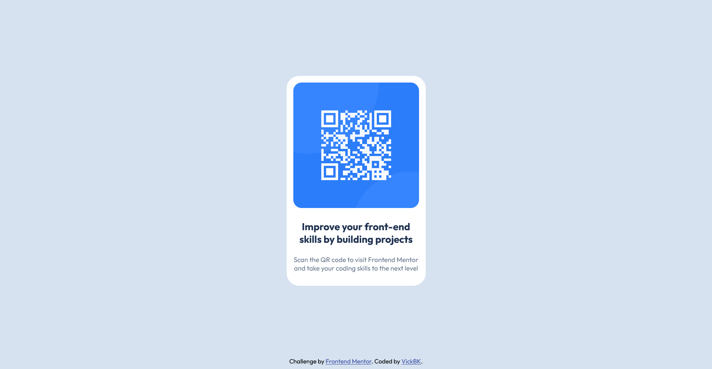

# Frontend Mentor - QR code component solution

This is a solution to the [QR code component challenge on Frontend Mentor](https://www.frontendmentor.io/challenges/qr-code-component-iux_sIO_H). Frontend Mentor challenges help in improving coding skills by building realistic projects.

## Table of contents

- [Overview](#overview)
  - [Screenshot](#screenshot)
  - [Links](#links)
- [My process](#my-process)
  - [Built with](#built-with)
  - [What I learned](#what-i-learned)
  - [Continued development](#continued-development)
  - [Useful resources](#useful-resources)
- [Author](#author)
- [Acknowledgments](#acknowledgments)

**Note: Delete this note and update the table of contents based on what sections you keep.**

## Overview

### Screenshot



Here is a screenshot of my solution.

### Links

- Solution URL: (https://github.com/vickbk/vickbk.github.io/tree/main/frontendmentor/qr-code-component-main)
- Live Site URL: (https://vickbk.github.io/frontendmentor/qr-code-component-main)

## My process

### Built with

- Semantic HTML5 markup
- CSS custom properties
- CSS Grid
- Mobile-first workflow

### What I learned

Wrapping the card item in the main element with 100vh for height to better center it vertically.
Then use css grid display and place-items property to center for vertical and horizontal center alignment

below some code snippet for this

```html
<main class="holder">
  <!-- card code in here -->
</main>
```

```css
.holder {
  height: 100vh;
  display: grid;
  place-items: center;
}
```

### Continued development

Following from here I want to focus on building more awesome projects with the help of frontend mentor :) and see what it gives out

### Useful resources

- (https://roadmap.io) - Helped me get started with this journey and still leading me throughout the process
- (https://courses.kevinpowell.co/conquering-responsive-layouts) - These ressources got my steps into basics of modern responsive design :)
- (https://www.frontendmentor.io) - Currently working with frontend mentor is upskilling me and I want to learn more here... Im not yet to leave

## Author

- Github - [@vickbk](https://github.com/vickbk)
- Frontend Mentor - [@vickbk](https://www.frontendmentor.io/profile/vickbk)
- Twitter - [@Vick_bk8](https://x.com/Vick_bk8)

## Acknowledgments

For this project I use most of the knowlegde I got from @KevinJPowell for css tricks and technics.
