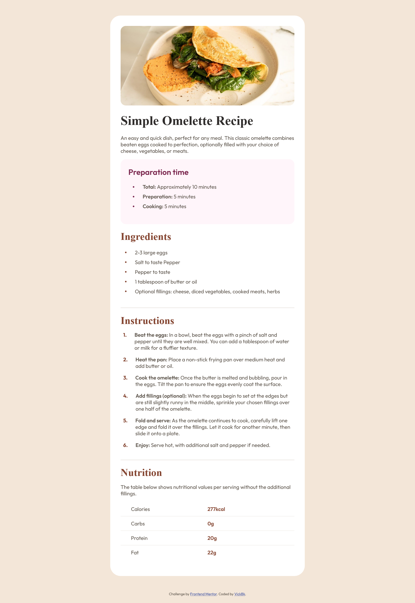
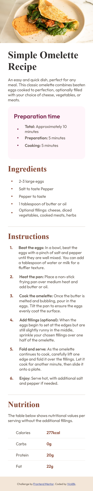

# Frontend Mentor - Recipe page solution

This is a solution to the [Recipe page challenge on Frontend Mentor](https://www.frontendmentor.io/challenges/recipe-page-KiTsR8QQKm). Frontend Mentor challenges help you improve your coding skills by building realistic projects.

## Table of contents

- [Overview](#overview)
  - [The challenge](#the-challenge)
  - [Screenshot](#screenshot)
  - [Links](#links)
- [My process](#my-process)
  - [Built with](#built-with)
  - [What I learned](#what-i-learned)
  - [Continued development](#continued-development)
  - [Useful resources](#useful-resources)
- [Author](#author)
- [Acknowledgments](#acknowledgments)

**Note: Delete this note and update the table of contents based on what sections you keep.**

## Overview

### Screenshot




### Links

- Solution URL: [Add solution URL here](https://github.com/vickbk/vickbk.github.io/tree/main/frontendmentor/recipe-page-main)
- Live Site URL: [Add live site URL here](https://vickbk.github.io/frontendmentor/recipe-page-main)

## My process

### Built with

- Semantic HTML5 markup
- CSS custom properties
- Flexbox
- Mobile-first workflow

### What I learned

In this project I learnt how to align verticaly the list dot using the :before property as I was unable to align it verticaly using the :marker property

I wanted to achieve it with the following code:

```css
li::marker {
  align-self: center;
}
```

But this was not possible, so I used the :before proporty to create a custom dot which I could easily align using display flex

```css
li {
  display: flex;
  align-items: center;
}
li::before {
  content: ".";
}
```

### Continued development

In the future I will keep focusing more on semantic HTML.

### Useful resources

### Useful resources

- (https://roadmap.io) - Helped me get started with this journey and still leading me throughout the process
- (https://courses.kevinpowell.co/conquering-responsive-layouts) - These ressources got my steps into basics of modern responsive design :)
- (https://www.frontendmentor.io) - Currently working with frontend mentor is upskilling me and I want to learn more here... Im not yet to leave

## Author

- Github - [@vickbk](https://github.com/vickbk)
- Frontend Mentor - [@vickbk](https://www.frontendmentor.io/profile/vickbk)
- Twitter - [@Vick_bk8](https://x.com/Vick_bk8)

## Acknowledgments

For this project I use most of the knowlegde I got from @KevinJPowell for css tricks and technics, roadmap.io for frontend developper roadmap.
