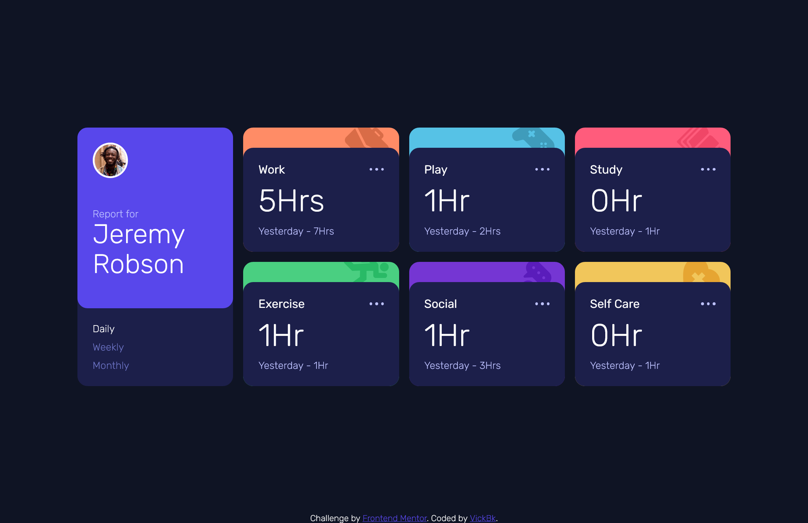
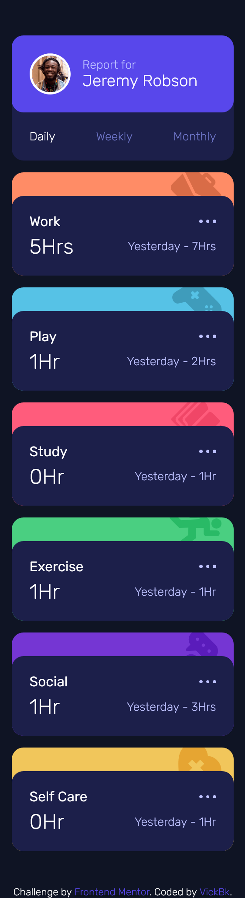

# Frontend Mentor - Time tracking dashboard solution

This is a solution to the [Time tracking dashboard challenge on Frontend Mentor](https://www.frontendmentor.io/challenges/time-tracking-dashboard-UIQ7167Jw). Frontend Mentor challenges help you improve your coding skills by building realistic projects.

## Table of contents

- [Overview](#overview)
  - [The challenge](#the-challenge)
  - [Screenshot](#screenshot)
  - [Links](#links)
- [My process](#my-process)
  - [Built with](#built-with)
  - [What I learned](#what-i-learned)
  - [Continued development](#continued-development)
  - [Useful resources](#useful-resources)
- [Author](#author)
- [Acknowledgments](#acknowledgments)

**Note: Delete this note and update the table of contents based on what sections you keep.**

## Overview

### The challenge

Users should be able to:

- View the optimal layout for the site depending on their device's screen size
- See hover states for all interactive elements on the page
- Switch between viewing Daily, Weekly, and Monthly stats

### Screenshot




### Links

- Solution URL: [Github Repository](https://github.com/vickbk/vickbk.github.io/tree/main/frontendmentor/time-tracking-dashboard-main)
- Live Site URL: [Github Page](https://vickbk.github.io/frontendmentor/time-tracking-dashboard-main)

## My process

### Built with

- Semantic HTML5 markup
- CSS custom properties
- CSS Grid
- Mobile-first workflow
- SASS for CSS optimization

### What I learned

In this project I practiced a lot of SASS and it was pretty cool actually.
I managed to create a clamp-builder within SASS directly which was actually awesome.

Before I used to visit [Font-size clamp builder site](https://clamp.font-size.app/) to do same but now it has become as simple as calling my own function in sass directly.

```css
.proud-of-this-css {
  font-size: f.clamp-builder(1.55rem, 3rem);
}
```

Then result be like:

```css
.proud-of-this-css {
  font-size: clamp(1.55rem, 1.0394366197rem + 2.1784037559vw, 3rem);
}
```

More details in the [Clamp-builder File](./sass/functions/_clamp-builder.scss)

### Continued development

I am keeping looking forward for imporvement.

### Useful resources

- [Roadmap](https://roadmap.io) - Helped me get started with this journey and still leading me throughout the process
- [Kevin Powell](https://courses.kevinpowell.co/conquering-responsive-layouts) - These ressources got my steps into basics of modern responsive design :)
- [Frontend Mentor](https://www.frontendmentor.io) - Currently working with frontend mentor is upskilling me and I want to learn more here... Im not yet to leave
- [Josh Comeau](https://www.joshwcomeau.com/) - Josh Comeau is now my new favorite for learning CSS tricks with interactive courses
- [Font size - Clamp generator](https://clamp.font-size.app/) - I got inpiration from this clamp generator created with ts and I applied mine with SASS

## Author

- Github - [@vickbk](https://github.com/vickbk)
- Frontend Mentor - [@vickbk](https://www.frontendmentor.io/profile/vickbk)
- Twitter - [@Vick_bk8](https://x.com/Vick_bk8)

## Acknowledgments

For this project I use most of the knowlegde I got from the frontend roadmap for css tricks and technics and various developement techniques...
